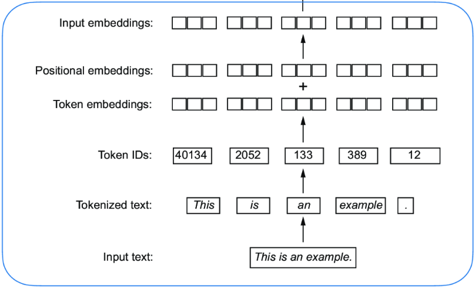
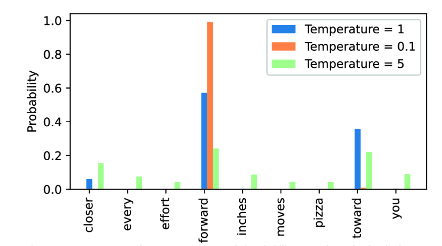

# Building an LLM from Scratch

## Tokenizing text

Flow: Tokenizer(Input text) -> Tokenized text (separate words) -> Token IDs -> Token embeddings

- Input text
- Tokenized text
- Token IDs
- Token embeddings + Positional embeddings
- Input embeddings

### Byte-Pair Encoding (BPE)

It breaks down unknown words into subwords or individual characters.

The BPE tokenizer can parse any word and doesn’t need to replace unknown words with special tokens, such as <|unk|> (even if it contains words that were not present in its training data.).

### Input-Target pair for LLM training

Create input (what the LLM receives) and target (what the LLM should predict) tensors based on the tokenized input text

Wrap the dataset into a dataloader. Enables iterating on the data for the training process.

### Token Embeddings

This phase is about the tranformation of Token IDs into Embeddings vectors.

To build an embedding, we need the vocabulary size (rows — every unique word/token) and the output dimension (columns — how much space/detail the model is allowed to use to capture the meaning of each token).

The generated embedding contains small, random values and it is optimized during LLM training through backpropagation.

With the embedding layer (weight matrix), we perform a lookup operation, retrieving the embedding vector corresponding to the token ID from the embedding layer’s weight matrix

### Encoding word positions

The same token ID always gets mapped to the same vector representation, regardless of where the token ID is positioned in the input sequence

Add two categories of position-aware embeddings:

- Relative positional embeddings: distance between tokens
- Absolute positional embeddings: specific position in the sequence

## Self-Attention

Self-attention computes attention weights for each part of the input sequence. It learns the relationships and dependencies between parts of the input sequence. This attention weight is the calculation of how much attention the token should pay attention to all other words in the input sequence.

Self-attention computes a context vector for each token. A context vector is a combination of all input vectors weighted with respect to the input element. It's the application of the attention mechanism and the output is fed into next block of the transformer architecture.

Context vector calculation:

- Compute attention scores: the attention score between a query token and each sequence token is calculated through a dot product between the two. It combines two vectors to produce a scalar value. It measures the similarity of how close they are.
- Compute attention weights (Normalization): divide the attention scores by the sum of all scores. The main goal behind the normalization is to obtain attention weights that sum up to 1.
  - It's more common to use softmax to normalize the scores
- Compute context vectors: the combination of all input vectors weighted by the attention weights

This output is an enriched representation of each token in the input sequence.

---

The weight parameters are the learned coefficients in the network training. 

It should compute the query, the key, and the value against each input token.

- Query = query weight x input
- Key = key weight x input
- Value = value weight x input

The dot product between each query and the other keys produces the attention score

- q_1 x k_1 = w11
- q_1 x k_2 = w12
- q_1 x k_3 = w13
- q_2 x k_1 = w21
- q_2 x k_2 = w22
- q_2 x k_3 = w23

Scale the attention scores by dividing them by the square root of the embedding dimension of the keys. This is why the self-attention mechanism is also called scaled-dot product attention.

With that, we get the attention weights.

To compute the context vectors, we need to compute the matrix multiplication between the attention weights and the value weights (attention_weights @ v).

### Causal Self-Attention: information leakage

Modify the self-attention mechanism to consider only tokens that appear prior to the current position when predicting the next token.

- Mask future tokens: zero attention weights above diagonal
- Normalized the nonmasked attention weights (the sum of the row will be 1)

### Dropout

A method to randomly select hidden layer units and drop them out. In practice, it's a drouput mask, where masking is about randomly zeroing some of the hidden layer units.

They can be applied into specific times:

- After calculating the attention weights
- After applying the attention weights to the value vectors

Because some values are zeroed, the attention weight becomes unnormalized again, but there is no need to normalize that because dropout scale up automatically, based on the dropout percentage (p=0.5 will lead to scaling up all the unmasked values to 1/0.5 = 2).

### Multi-head Attention

Dividing the attention mechanism into multiple heads, with independent operations.

- Create multiple instances of the self-attention mechanism
- Combine their outputs
- Run the attention mechanism multiple times, in parallel

### Generating the Next Token

- Encode text input
- GPT outputs the matrix logits
- Extract the last vector (next token)
- The last vector for the given input token is the scores for the whole vocabulary (logits)
  - Vector of size = vocab size, meaning there is a score for each token in the vocabulary
  - This vector is the distribution that can be turned into a probability distribution using softmax
- Convert logits into probability (softmax) to get the next token
- Get the index of the largest probability value (index = token ID)
  - The index holds the place of each token in the vocabulary
- Decode token ID into text (next token)
- Append the token to the original input text to generate the next token

## Pretraining

- Training Loop
- Model Evaluation
- Load pretrained weights

### Model Training & Text Evaluation

- Measure “how far” the generated tokens are from the correct predictions (targets)
  - Get the index of highest probability
  - Negative log (loss): the loss of the predicted token with the target
  - Average all losses
  - Negative average loss (cross entropy)
- The goal is improve the learned parameters to adjust the model to generate text that is more similar or equally matches the target text
- The model training aims to increase the softmax probability in the index positions corresponding to the correct target token IDs

Here are all the parameters learned in the model training

**Embeddings**
| Layer     | Shape        | Parameters |
| --------- | ------------ | ---------- |
| `tok_emb` | 50,257 × 768 | 38,597,376 |
| `pos_emb` | 256 × 768    | 196,608    |

**Per Transformer block (×12 layers)**
| Layer                              | Shape               | Parameters     |
| ---------------------------------- | ------------------- | -------------- |
| `W_query`                          | 768 × 768           | 589,824        |
| `W_key`                            | 768 × 768           | 589,824        |
| `W_value`                          | 768 × 768           | 589,824        |
| `out_proj` weight + bias           | 768 × 768 + 768     | 590,592        |
| FeedForward linear 1 weight + bias | 768 × 3,072 + 3,072 | 2,362,368      |
| FeedForward linear 2 weight + bias | 3,072 × 768 + 768   | 2,360,064      |
| `layer_norm1` scale + shift        | 768 + 768           | 1,536          |
| `layer_norm2` scale + shift        | 768 + 768           | 1,536          |
| **Subtotal per block**             |                     | **7,085,568**  |
| **×12 blocks**                     |                     | **85,026,816** |

**Final layers**
| Layer                       | Shape        | Parameters |
| --------------------------- | ------------ | ---------- |
| `final_norm` scale + shift  | 768 + 768    | 1,536      |
| `out_head` weight (no bias) | 768 × 50,257 | 38,597,376 |

**Total: ~124.4M parameters** — which matches the `GPT_CONFIG_124M` name.

## Controlling Randomness: temperature scaling and top-k sampling

Temperature scaling: dividing the logits by the temperature value (scaling)

- `T < 1` — sharper / more confident: Dividing by a small number amplifies the gaps between logits. The highest-scoring token gets an even larger relative advantage, so the model becomes more deterministic and repetitive.
- `T = 1` — no change: Dividing by 1 is a no-op. You get the model's natural distribution.
- `T > 1` — flatter / more random

Top-k sampling: restrict the sampled tokens to the top-k most likely tokens and exclude all other tokens

- Select the top k most likely tokens for the next-token prediction
- Assigns –inf to the lower logits
- Apply softmax to the logits: the -inf values will be transformed into 0 (zeroing the probability of being chosen)
